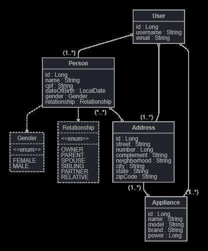

# Pós-Tech Arquitetura e Desenvolvimento Java
- Fase 2: Nesta segunda fase, o objetivo era alterar a API desenvolvida na fase anterior para adicionar a persistência das informações em banco de dados e criar as APIs de leitura, alteração e exclusão dos dados. 
        
## Índice

- [Pré-requisitos](#pré-requisitos)
- [Instalação](#instalação)
- [Uso](#uso)
- [Relatório técnico](#relatório-técnico)

## Pré-requisitos
Para rodar o projeto na sua máquina é necessário: 
- Java 17
- Maven

## Instalação
Siga as etapas abaixo para configurar e executar o projeto em seu ambiente local:
1. Clone o repositório
   ```sh
   git clone https://github.com/mayaravlima/tech-challenge-fase-2
   ```  
2. Navegue até o diretório do projeto:
   ```sh
   cd tech-challenge-fase-2
   ```
3. Instale as dependências
   ```sh
    mvn clean install
    ```
4. Rode o projeto
   ```sh
   mvn spring-boot:run
   ```
7. Acesse os endpoints 
   ```sh
   localhost:8080/
   ```
## Uso
Foi utilizado o Swagger para documentar a API. Para acessar a documentação basta acessar o endpoint:
    
```sh
    http://localhost:8080/swagger-ui/index.html#/
```
Considerações sobre alguns endpoints:

### User Controller
- POST /user: Cria um usuário.
  - Para cadastrar um user as seguintes regras devem ser seguidas:
    - "username" não pode ser nulo ou vazio. Deve contar apenas letras, números, traços e underscores. Deve ter entre 3 e 20 caracteres.
    - "email" deve ser válido. Não pode ser vazio ou nulo.
    - "name" não pode ser nulo ou vazio. Deve conter apenas letras e espaços. Deve ter entre 5 e 50 caracteres.
    - "cpf" deve ser válido. Não pode ser vazio ou nulo.
    - "dateOfBirth" não pode ser nulo ou vazio. Deve ser uma data do passado.
    - "gender" deve ser ou "FEMALE" ou "MALE"
    - "username", "email", "cpf" devem ser únicos.
  - JSON Body:
   ```JSON
  {
    "username": "maylima",
    "email": "may@email.com",
    "name": "Mayara Lima",
    "date_of_birth": "26/08/1994",
    "gender": "FEMALE",
    "cpf": "02594680028"
   }
   ```

- GET /user/search: Busca usuário com os seguintes paramentros:
  - GET /user/search?username={username}: Busca usuário pelo username.
  - GET /user/search?email={email}: Busca usuário pelo email.
  - GET /user/search?username={username}&email={email}: Busca pelo username e email.

### Person Controller
- POST /person: Cria uma pessoa.
  - Um header "username":"username" deve ser enviado na request com o username de um usuário já cadastrado.
  - Para cadastrar uma pessoa as seguintes regras devem ser seguidas:
  - "name" não pode ser nulo ou vazio. Deve conter apenas letras e espaços. Deve ter entre 5 e 50 caracteres.
  - "cpf" deve ser válido. Não pode ser vazio ou nulo.
  - "dateOfBirth" não pode ser nulo ou vazio. Deve ser uma data do passado.
  - "gender" deve ser ou "FEMALE" ou "MALE"
  - "relationship" deve ser:
    - "PARTNER" se for o cônjuge do usuário.
    - "SPOUSE" se for o cônjuge do usuário.
    - "PARENT" se for um dos pais do usuário.
    - "CHILD" se for um dos filhos do usuário.
    - "PARENT" se for um dos pais do usuário.
    - "SIBLING" se for um dos irmãos do usuário.
    - "RELATIVE" se for um parente do usuário.
  - JSON BODY
   ```JSON
  {
    "name": "Sonia Lima",
    "date_of_birth": "24/04/1971",
    "gender": "FEMALE",
    "relationship": "PARENT",
    "cpf": "85936419037"
   }
   ```

- POST /person/{personId}/address/{addressId}: Associa uma pessoa a um endereço
  - Um header "username":"username" deve ser enviado na request com o username de um usuário já cadastrado.
  - Um id de uma pessoa e um id de um endereço devem ser enviados na request.


- GET /person/search: Busca pessoa com os seguintes paramentros:
  - GET /person/search/name/{name}: Busca pessoa pelo nome.
  - GET /person/search/relationship/{relationship}: Busca pessoa pelo relacionamento.
  - GET /person/search/gender/{gender}: Busca pessoa pelo gênero.
  - GET /person/search/cpf/{cpf}: Busca pessoa pelo cpf.
   
### Address Controller
- POST /address: Cria um endereço
  - Um header "username":"username" deve ser enviado na request com o username de um usuário já cadastrado.
  - Para cadastrar um endereço as seguintes regras devem ser seguidas:
  - "street" não pode ser nulo ou vazio. Deve ter entre 3 e 50 caracteres.
  - "number" não pode ser nulo ou vazio.
  - "city" não pode ser nulo ou vazio. Deve ter entre 3 e 50 caracteres.
  - "state" não pode ser nulo ou vazio. Deve ter entre 3 e 50 caracteres.
  - "neighborhood" não pode ser nulo ou vazio. Deve ter entre 3 e 50 caracteres.
  - "zipCode" não pode ser nulo ou vazio. Deve conter apenas números. Deve 8 caracteres.
  - JSON BODY
   ```JSON
  {
    "street": "Avenida Wallace Simonsen",
    "number": 6,
    "neighborhood": "Centro",
    "city": "São Bernardo do Campo",
    "state": "São Paulo",
    "zipCode": "09774547"
   }
   ```
  
- POST /address/{addressId}/appliance/{applianceId}: Asssocia um endereço a um eletrodoméstico
  - Um header "username":"username" deve ser enviado na request com o username de um usuário já cadastrado.
  - Um id de um endereço e um id de um eletrodoméstico devem ser enviados na request.

- Get /address/search: Busca endereço com os seguintes paramentros:
  - GET /address/search/street/{street}: Busca endereço pela rua.
  - GET /address/search/neighborhood/{neighborhood}: Busca endereço pelo bairro.
  - GET /address/search/city/{city}: Busca endereço pela cidade.
  - GET /address/search/state/{state}: Busca endereço pelo estado.

### Appliance Controller   
- POST /appliance: Cria um eletrodoméstico
  - Um header "username":"username" deve ser enviado na request com o username de um usuário já cadastrado.
  - Para cadastrar um eletrodoméstico as seguintes regras devem ser seguidas:
    - "name" não pode ser nulo ou vazio. Deve ter entre 2 e 50 caracteres.
    - "brand" não pode ser nulo ou vazio. Deve ter entre 2 e 50 caracteres.
    - "model" não pode ser nulo ou vazio. Deve ter entre 2 e 50 caracteres.
    - "power" não pode ser nulo ou vazio. Deve ser um número maior que 0.
  - JSON BODY
   ```JSON
  {
    "name": "Microondas",
    "brand": "Electrolux",
    "model": "MI41S",
    "power": 1500
   }
   ```

- GET /appliance/search: Busca eletrodoméstico com os seguintes paramentros:
  - GET /appliance/search/name/{name}: Busca eletrodoméstico pelo nome.
  - GET /appliance/search/brand/{brand}: Busca eletrodoméstico pela marca.
  - GET /appliance/search/model/{model}: Busca eletrodoméstico pelo modelo.
  - GET /appliance/search/power/{power}: Busca eletrodoméstico pela potência.

- POST /appliance/calculate
  - Para calcular o consumo de um eletrodoméstico em KWh, deve ser enviado um JSON com os seguintes campos:
    - "appliance_id": id do eletrodoméstico.
    - "hours_of_use": horas de uso do eletrodoméstico por dia.
  - JSON BODY
   ```JSON
  {
    "appliance_id":1,
    "hours_of_use":20
   }
   ```

## Relatório Técnico
Dependências novas utilizadas:
- Para essa fase optei em utilizar o banco de dados H2, pois ele é incorporado diretamente na API, não exigindo uma instalação separada ou configurações complexas.
- À medida que a quantidade de endpoints se expandia, optei por utilizar o Swagger OpenAPI para automatizar a geração da documentação.


Estrutura da API:
- A arquitetura do banco de dados pensanda foi: 



Parti do princípio que um usuário tem várias propriedades, e em cada propriedade há um endereço com várias pessoas e vários eletrodomésticos.
- Um usuário tem associado várias pessoas e ele mesmo é salvo com uma pessoa do tipo OWNER.
- Um usuário tem associado vários endereços.
- Um usuário tem associado vários eletrodomésticos.
- Uma pessoa tem associado vários endereços.
- Um endereço tem associado vários eletrodomésticos.
- Um eletrodoméstico tem associado apenas um endereço.

O seguinte fluxo de cadastro foi pensando:
- 1º Cadastrar um usuário com uma pessoa do tipo OWNER.
- 2º Cadastrar pessoas associadas a esse usuário.
- 3º Cadastrar endereços associados a esse usuário.
- 4º Cadastrar eletrodomésticos associados a esse usuário.
- 5º Associar eletrodomésticos a um endereço.
- 6º Associar pessoas a um endereço.

Decisões de projeto:
- Somente o usuário controla o sistema. Ou seja, todas as operações de CRUD são feitas através do username dele.
- Se um usuário é deletado, todas as pessoas, endereços e eletrodomésticos associados a ele também são deletados.
- Se um endereço é deletado, todos os eletrodomésticos associados a ele também são deletados. Ou seja, o endereço é o dono da relação de eletrodomésticos. A relacão entre eletrodomésticos e pessoas é feita através do endereço. Simulando um casa que tem seus eletrodomésticos que pode ser utilizado por todas as pessoas que moram nela.
- Um usuário só pode ter uma pessoa cadastrada como PARTNER ou SPOUSE, e duas pessoas como PARENT.
- O número de CPF é único para cada pessoa.
- O email e username é único para cada usuário.
